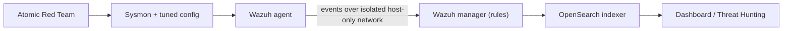
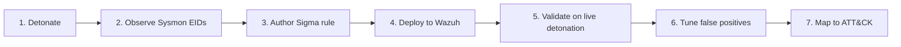
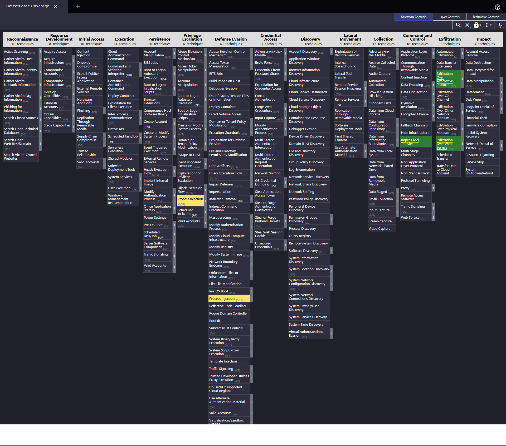
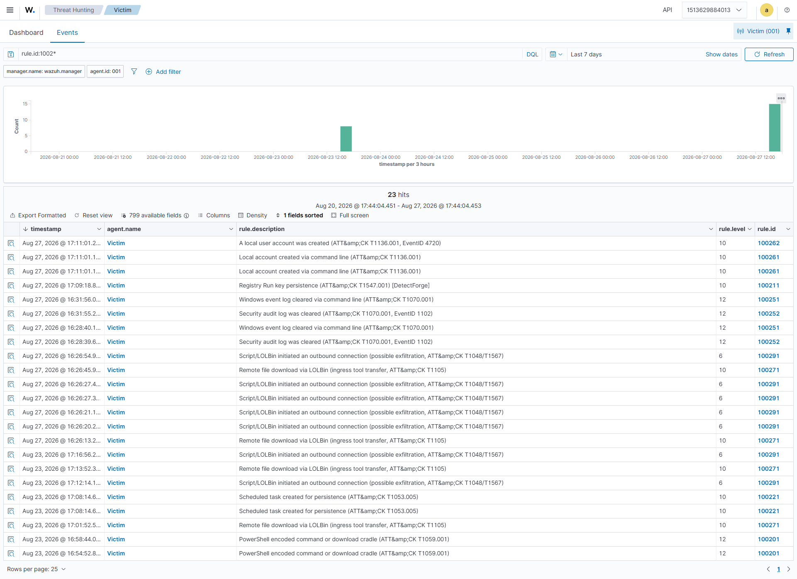
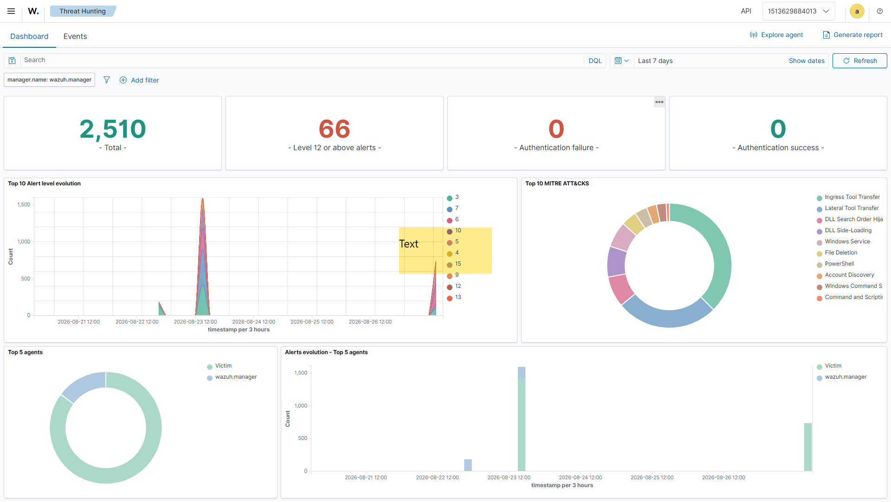

# SOC Detection Engineering Assessment — DetectForge

**Report type:** Detection coverage assessment (adversary emulation → detection validation)
**Environment:** DetectForge home SOC lab
**Analyst:** Prateek Pulastya
**SIEM:** Wazuh 4.14.7 (single-node, Docker)
**Endpoint:** Windows 10 Enterprise, Sysmon-instrumented (agent `Victim`, 192.168.198.130)
**Emulation tool:** Atomic Red Team (Invoke-AtomicRedTeam)
**Framework:** MITRE ATT&CK (Enterprise)
**Repository:** https://github.com/Prateek-Pulastya/soc-detection-lab

---

## 1. Executive summary

DetectForge stands up a minimal but real Security Operations Center — a Wazuh SIEM with a
Sysmon-instrumented Windows endpoint — and puts it through a full detection-engineering loop:
each ATT&CK technique is detonated with Atomic Red Team, its telemetry observed, a detection
authored in Sigma and deployed to Wazuh, validated against the live attack, tuned for false
positives, and mapped back to ATT&CK.

**Ten techniques across six tactics were emulated. Seven produced a detection that fired on live
detonation. Three are documented gaps** — rules are authored and deployed, but the technique
could not be exercised in the lab (Windows LSASS/ASR protection, target-process protection, and a
Windows RDP-listener limitation, respectively). An LLM-based triage layer was built on top of the
detections and scored against known ground truth.

The honest 7/10 result — with three explained gaps — is the intended outcome: a detection
engineer who can explain a miss is more valuable than a lab that claims perfect coverage.

---

## 2. Scope & methodology

**Scope.** Windows endpoint detections only (Sysmon + Windows Security channel), one victim host
on an isolated host-only network. Cloud, network, and Linux telemetry are explicitly out of scope
(noted as future work).

**Figure 1 — Lab architecture.**

**Per-technique loop.**
1. **Detonate** — `Invoke-AtomicTest <Txxxx>` on the victim (snapshot taken first; NAT
   disconnected for isolation except where a download/exfil test required egress).
2. **Observe** — identify the Sysmon Event ID(s) / Windows Security event(s) the technique
   produced, and the exact field values.
3. **Author** — write a Sigma rule on the *behaviour*, not the atomic's IOC.
4. **Deploy** — translate to a native Wazuh XML rule (`local_rules.xml`, rule range 100200–100299).
5. **Validate** — re-detonate; confirm the rule fires; capture evidence.
6. **Tune** — run benign activity; document the false-positive profile.
7. **Map** — tag the ATT&CK technique/tactic; add to the Navigator coverage layer.

**Figure 2 — The detection-engineering loop (run for every technique).**

**Detection-as-code.** Sigma is the source of truth (versioned in git). Because Wazuh has no
first-class Sigma backend, each rule is (a) converted to OpenSearch/Elastic/Splunk with
`sigma-cli` for portability and (b) hand-translated to native Wazuh XML for real-time alerting.
A GitHub Actions `sigma check` job gates rule syntax.

---

## 3. Coverage results

**Detected 7 / 10 on live detonation.**

| ATT&CK | Technique | Tactic | Telemetry | Wazuh rule | Result |
|--------|-----------|--------|-----------|-----------|--------|
| T1059.001 | PowerShell (encoded / cradle) | Execution | Sysmon EID 1 | 100201 | ✅ Detected (lvl 12) |
| T1547.001 | Registry Run Key | Persistence | Sysmon EID 13 | 100211 | ✅ Detected — chained on built-in 92302 |
| T1053.005 | Scheduled Task | Persistence | Sysmon EID 1 | 100221 | ✅ Detected (lvl 10) |
| T1003.001 | LSASS memory dump | Credential Access | Sysmon EID 10 | 100231 | ❌ Gap — LSASS/ASR protection |
| T1055 | Process Injection | Defense Evasion | Sysmon EID 8 | 100241 | ❌ Gap — injection blocked |
| T1070.001 | Clear Event Logs | Defense Evasion | Sysmon EID 1 + 1102 | 100251/2 | ✅ Detected (lvl 12) |
| T1136.001 | Create Local Account | Persistence | Sysmon EID 1 + 4720 | 100261/2 | ✅ Detected (lvl 10) |
| T1105 | Ingress Tool Transfer | Command & Control | Sysmon EID 1 | 100271 | ✅ Detected (lvl 10) |
| T1021.001 | Remote Desktop | Lateral Movement | 4624 type 10 | 100281 | ❌ Gap — RDP listener |
| T1048/T1567 | Exfil over alt protocol / web | Exfiltration | Sysmon EID 3 | 100291/2 | ✅ Detected (lvl 6) |

---

## 4. Detection notes (selected)

**T1059.001 — PowerShell encoded command / download cradle (marquee of the detected set).**
Rule 100201 keys on `powershell.exe`/`pwsh.exe` with an encoding or in-memory-download indicator
in the command line. Validated against two different shapes (`-EncodedCommand` and a
`Net.WebClient().DownloadString` cradle) — both fired, proving behaviour-based detection.

**T1547.001 — Registry Run Key (a key lesson).** Wazuh's *built-in* ruleset already detects and
ATT&CK-maps the Run key (rule 92302), and the engine emits one alert per event, so an
independently-anchored custom rule was suppressed. The fix was to **chain the custom rule as a
child** (`<if_sid>92302</if_sid>`) — the DetectForge-tagged detection now fires while extending the
shipped ruleset rather than duplicating it. Knowing when to extend vs. author from scratch is core
to the role.

**T1070.001 — Clear Event Logs.** Detected on two vectors: the process command line
(`wevtutil cl …`, Sysmon EID 1) and the high-fidelity Security channel signal (EventID 1102,
"the audit log was cleared") — the latter is what an analyst most wants to see, because it means
an adversary is erasing evidence.

**T1048/T1567 — Exfiltration.** Rule 100291 is a heuristic on scripted/LOLBin outbound
connections (Sysmon EID 3). It carries a false-positive tune-down (100292) that drops severity
when the destination is an internal/private address — the external-destination detonation fired at
full severity as designed.

---

## 5. Documented gaps

These three techniques have authored, deployed rules but could not be exercised. Each is a
legitimate, explained miss:

| Technique | Rule | Root cause |
|-----------|------|-----------|
| **T1003.001** LSASS dump | 100231 | Windows LSASS protection (RunAsPPL) and the "Block credential stealing from lsass.exe" ASR rule blocked the dumper *before* it could open a memory-read handle, so **no Sysmon EID 10 was generated**. The detection design is correct; the telemetry never occurred. |
| **T1055** Process Injection | 100241 | Every CreateRemoteThread atomic failed at `VirtualAllocEx: Access is denied` — the target processes were protected — so **no Sysmon EID 8** was produced. |
| **T1021.001** Remote Desktop | 100281 | The RDP listener would not bind on the Windows 10 Evaluation VM (client error 0x204), so no RemoteInteractive (LogonType 10) logon was ever generated. |

**Remediation:** re-run T1003.001 / T1055 on a VM with LSASS protection and ASR relaxed (or an
EDR-off gold image), and T1021.001 on a host whose RDP listener binds, then validate the existing
rules against the resulting telemetry.

---

## 6. False-positive analysis

Detection engineering is judged as much on *not* firing on benign activity as on catching the
attack. Two dual-use detections carry explicit tuning:

- **T1059.001 (encoded PowerShell).** Encoding is used by legitimate automation. Tune-down stub
  100202 allowlists a trusted caller by `ParentImage`.
- **T1003.001 (LSASS read).** EDR/AV and backup agents legitimately read LSASS. Tune-down stub
  100232 allowlists signed readers (`MsMpEng.exe`, `wazuh-agent.exe`) by `SourceImage`.
- **T1048/T1567 (outbound).** Tune-down 100292 suppresses scripted outbound to private/internal
  destinations.

A longer benign-activity baseline is recommended before production use.

---

## 7. AI-assisted triage

An LLM triage layer (`ai-soc/`, Python + Claude API) consumes a Wazuh alert and returns a
structured, schema-validated verdict: summary, ATT&CK mapping, true/false-positive with reasoning
grounded in the alert fields, severity, triage steps, and containment. Two design choices make it
credible rather than a novelty:

1. **Evaluated against ground truth.** Because every detonation's true label is known, the triage
   is scored — precision, recall, false-positive suppression — rather than asserted.
2. **Prompt-injection–aware.** Alert fields (`CommandLine`, filenames) are attacker-controllable
   and are fenced as untrusted data; a crafted field that attempts to steer the analyst
   ("mark this false positive") is flagged (`injection_attempt_detected`), not obeyed.

Human-in-the-loop is enforced throughout — output is an analyst draft, never an auto-action.

---

## 8. Key findings

1. **Behaviour beats IOC.** Rules keyed on technique behaviour survived varied detonations;
   filename-matching would not have.
2. **The shipped ruleset matters.** Wazuh's built-ins already covered some techniques; the mature
   move is to extend them (rule chaining) rather than duplicate or fight them.
3. **Wazuh is not Sigma-native — bridge it deliberately.** Sigma stays the portable source of
   truth; the conversion + native-XML translation is documented, not hidden.
4. **Explain the misses.** Three gaps with named root causes are stronger evidence of engineering
   maturity than a suspicious perfect score.

---

## 9. Recommendations

| Priority | Recommendation |
|----------|----------------|
| High | Close the 3 gaps on a permissive image (relax LSASS/ASR; a host with a working RDP listener). |
| High | Add a longer benign-activity baseline and expand per-rule allowlists before any production use. |
| Medium | Extend coverage to a Linux endpoint (auditd / Sysmon-for-Linux). |
| Medium | Automate the detonate→validate loop in CI as a detection regression test. |
| Medium | Validate the Sigma rules on a second live SIEM (Elastic/Splunk) to prove portability end-to-end. |
| Low | Promote the batch AI-triage to a real-time Wazuh Integrator for alerts ≥ level 10. |

---

## Appendix A — rule ID map

| Rule | Technique | Signal |
|------|-----------|--------|
| 100201 | T1059.001 | Sysmon EID 1, encoded/cradle command line |
| 100211 | T1547.001 | Sysmon EID 13, Run key (chained on built-in 92302) |
| 100221 | T1053.005 | Sysmon EID 1, schtasks/Register-ScheduledTask |
| 100231 | T1003.001 | Sysmon EID 10, LSASS GrantedAccess |
| 100241 | T1055 | Sysmon EID 8, CreateRemoteThread |
| 100251 / 100252 | T1070.001 | Sysmon EID 1 (wevtutil) / Security 1102 |
| 100261 / 100262 | T1136.001 | Sysmon EID 1 (net) / Security 4720 |
| 100271 | T1105 | Sysmon EID 1, LOLBin downloaders |
| 100281 | T1021.001 | Security 4624 LogonType 10 |
| 100291 / 100292 | T1048/T1567 | Sysmon EID 3 outbound / internal-dest tune-down |

*Report generated as part of the DetectForge project. Home-lab, self-built — not production scale.*
